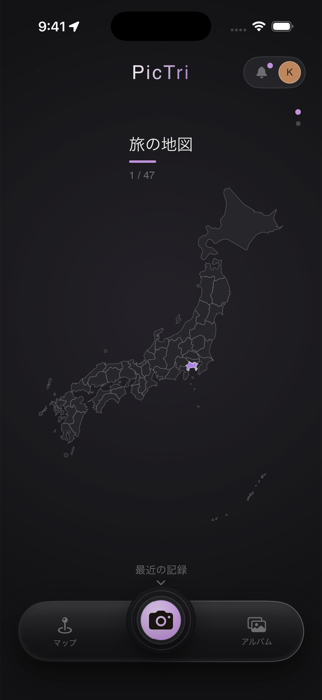
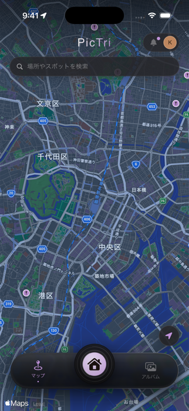
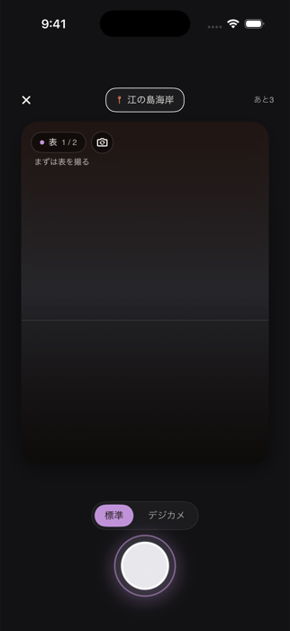
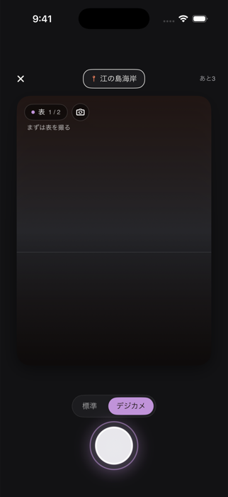
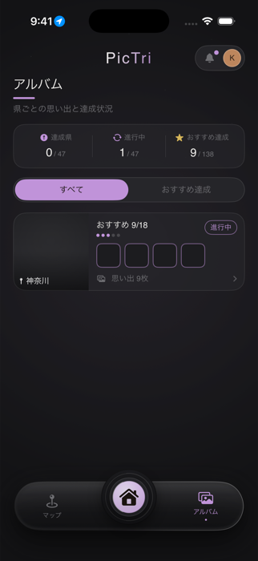

# PicTri

旅の写真と場所を記録し、訪れた場所そのものを思い出として集めるiOSアプリ。

## Overview

PicTriは、地図上のスポットを見つけて実際にその場所へ行き、位置情報で撮影を検証したうえで写真を残す、場所起点の旅行写真アプリです。単なる写真保存アプリでも、投稿中心のSNSでもなく、「どこに行ったか」がそのまま記憶として積み上がっていく体験を目指しています。

コアフローは次の通りです。

```
Mapでスポットを見つける → 現地でCameraを起動 → GPSで撮影可否を判定 → 撮影 → Homeに反映 → Memories/Albumに場所ごとの記録として残る
```

## Screenshots

| Home | Map |
|---|---|
|  |  |

| Camera（Standard） | Camera（Digicam） |
|---|---|
|  |  |

| Album |
|---|
|  |

すべてSimulator上のUIキャプチャです。人物・実写真・個人情報は含まれていません。

## Core Features

- 表 / 裏の2面Memory（外カメラで場所、内カメラで自分を同時に記録）
- World Map（日本全国 + 一部海外を含むRecommended Spotカタログ、ズーム段階に応じたマーカー密度制御）
- GPSによる撮影可否判定（登録スポットの半径内でのみ「認証撮影」が成立、圏外でも安全に「Anywhere」記録は可能）
- 都道府県ごとの進捗（Prefecture Progress）
- Memories / Album（訪れた場所ごとに写真をまとめて振り返る）
- Standard Camera（AVFoundationの実解像度・画質優先設定をそのまま活かす撮影パイプライン）
- Digicam Mode（2000年代コンパクトデジカメの見た目を、撮影前のライブプレビューから確認できるモード）

## Tech Stack

- Swift / SwiftUI
- MapKit
- AVFoundation
- Core Image
- Core Location
- Git / GitHub

## Architecture

```
ContentView（Root Coordinator）
 ├─ HomeView            … フィード・都道府県別進捗・投稿カード
 ├─ MapView / PictriWorldMapScreen … 世界地図・日本地図・Spot選択
 ├─ CameraView          … 2面撮影・Standard/Digicamモード・Review/Retake
 ├─ MemoriesView / PictriAlbumScreen … 場所ごとの記録一覧
 │
 ├─ QuestMemoryStore    … 撮影データの永続化・Feed/Memories生成（@EnvironmentObject）
 ├─ QuestLocationManager… CoreLocationラップ、位置権限・現在地
 ├─ QuestCameraService  … AVCaptureSession管理（CameraView専用@StateObject）
 └─ QuestSampleData     … Recommended Spotカタログ（都道府県・座標・解錠半径）
```

State/Storeの生成場所と参照範囲（`@StateObject` vs `@EnvironmentObject`）を明確に分離し、`QuestCameraService`はCamera画面のみがローカルに保持する設計にしています。

## Technical Challenges

実装しながら実際に発生した課題と、その解決アプローチです。

- **Camera / Review / Home投稿の写真比率を一致させる**: Homeの投稿カードは複数の制約（画面高さ比率・端末セーフエリア）から動的に最終表示比率が決まる。理論式だけでは実際の表示比率と一致しないことが実機計測で判明し、実測値を唯一の共有定数（`PictriPhotoGeometry`）としてCamera / Reviewの両方から参照する構成に修正した。
- **Map: 選択したSpotを最寄りSpotより優先する**: Spot半径が近接するケースで「ユーザーが明示的にMapから選んだSpot」を「単純な最寄りSpot判定」より常に優先させるロジックを実装。
- **AVFoundationのorientation統一**: Live Preview（`AVCaptureVideoPreviewLayer`）・Live Digicam Preview（`AVCaptureVideoDataOutput`）・最終撮影（`AVCapturePhotoOutput`）という3つの出力それぞれが独立したorientation policyを持ちうる構造だったため、単一のrotation angle適用ルールに統一した。
- **前面/背面カメラ切り替えとCamera Styleの分離**: 「Standard/Digicamの見た目切り替え」と「前面/背面カメラの物理的な切り替え」を完全に独立したstateとして設計し、片方の変更がもう片方に波及しないことをコードレベルで保証した。
- **Live Digicamプレビュー**: 撮影後にしか見た目が反映されない実装から、`AVCaptureVideoDataOutput` + Core Imageで低解像度frameをリアルタイム処理し、撮影前のライブプレビューからデジカメ風の見た目を確認できる構成へ変更。プレビュー用の軽量レシピと、最終撮影用のフルレシピを1つの共有モデル（`PictriDigicamProfile`）で管理し、別々のmagic numberに分岐しないようにしている。
- **Mapのマーカー密度制御**: ズームレベル（world/country/local）に応じて表示するSpotの数を切り替え、国レベルのズームでピンが密集しすぎないようにしている。
- **都道府県ごとの一意な進捗管理**: Recommended Spotカタログ全体を1つの配列で管理しつつ、都道府県ごとの達成数を動的に集計する設計。

## Design Philosophy

PicTriは「旅をシステム化する」アプリではなく、写真と場所を記憶（Memory）として残すアプリを目指しています。スタンプラリーのような達成感の演出よりも、静かで上質な、写真そのものが主役になるUIを優先しています。

## Development

個人開発です。実装支援・検証・リサーチにClaude Code / ChatGPTを利用し、プロダクト設計・仕様決定・UI/UX判断・実機検証は開発者自身が行っています。

## Status

現在開発中です。
