# ピクトリ（Pictri）システム構成書

バージョン: 1.0  
作成日: 2026-06-08  
対象フェーズ: 開発MVP〜公開MVP

---

## 1. システム構成図の目的

本書は、ピクトリのシステム全体の構成を定義することを目的とする。

扱う範囲は以下である。

- iOS アプリ内部のレイヤー構成と各層の役割
- Apple フレームワーク（MapKit / CoreLocation / AVFoundation）との連携
- ローカル保存（UserDefaults / Documents Directory）の構成
- モックデータの位置づけと開発MVP での役割
- 将来のバックエンド（Firebase または Supabase）との接続方針
- 認証・画像ストレージ・データ同期の設計
- 開発MVP から公開MVP への移行方針

本書は `docs/04_INTERNAL_DESIGN.md`（実装レベルの詳細）と対をなし、システム全体の配置と境界を俯瞰する。

---

## 2. 全体アーキテクチャ概要

ピクトリは、iOS ネイティブアプリとして実装する。

```
ユーザー
  ↕
iOSアプリ（SwiftUI / Swift）
  ├── Apple フレームワーク
  │     ├── MapKit（地図表示）
  │     ├── CoreLocation（位置情報・位置認証）
  │     └── AVFoundation（カメラ撮影）
  │
  ├── ローカルストレージ（開発MVP）
  │     ├── UserDefaults（メタデータJSON）
  │     └── Documents Directory（JPEGファイル）
  │
  └── バックエンド（公開MVP 以降）
        ├── 認証サービス（Auth）
        ├── データベース（DB）
        └── 画像ストレージ（Storage）
```

アーキテクチャの基本方針は以下である。

- **開発MVP はオフライン完結。** ネットワークに依存しない。
- **Apple 標準フレームワークを最大限活用する。** MapKit / CoreLocation / AVFoundation を直接使用する。
- **将来のバックエンド接続を見越した Store 境界を設ける。** Store の public インターフェースを変えずに内部実装だけ差し替えられるようにする。

### 2-2. コアフロー構成図（Map → Camera → Save → Memories → Home）

ピクトリのコアフローは以下の通りである。保存処理（Save）が `QuestMemoryPhoto`（永続）と `QuestFeedPost`（7日期限）の2つを同時に生成する点がアーキテクチャの核心である。

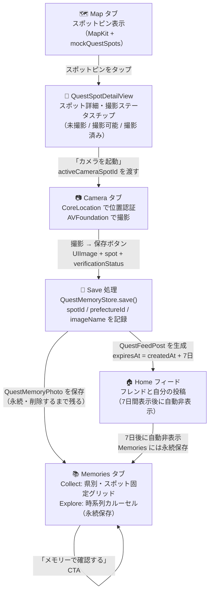

---

## 3. 開発MVP の構成

### 3-1. 構成図

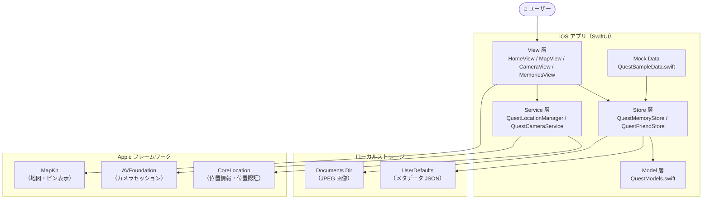

### 3-2. 構成の特徴

| 特徴 | 詳細 |
|-----|-----|
| ネットワーク不要 | 認証・API 呼び出しなし |
| データ永続化 | UserDefaults（JSON）+ Documents Dir（JPEG）のみ |
| フレンド・投稿 | `QuestSampleData.swift` のモックデータで代替 |
| 認証 | なし。固定ユーザー `user_keita` を使用 |
| いいね・コメント | View の `@State` でローカル管理のみ |

---

## 4. 公開MVP の構成

### 4-1. 構成図

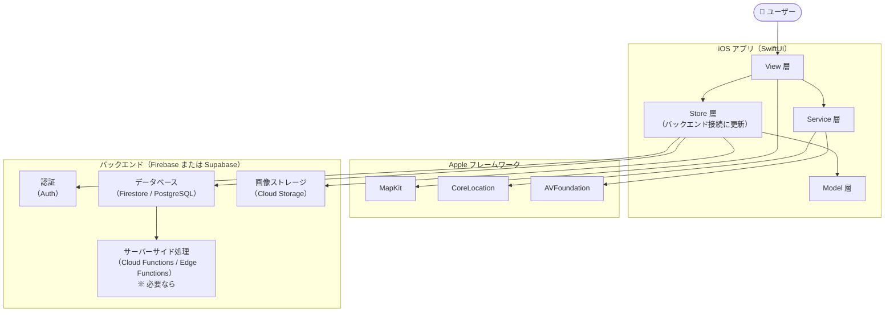

### 4-2. 開発MVP との差分

| 項目 | 開発MVP | 公開MVP |
|-----|--------|--------|
| 認証 | なし | Auth（メール / Apple Sign-In 等） |
| フレンドデータ | モック | DB からリアルタイム取得 |
| 投稿データ | UserDefaults | DB に保存・取得 |
| いいね・コメント | ローカル @State | DB に書き込み・読み込み |
| 画像ストレージ | Documents Dir | Cloud Storage |
| データ同期 | なし | リアルタイムまたは定期同期 |

---

## 5. iOS アプリ内部構成

### 5-1. レイヤー図

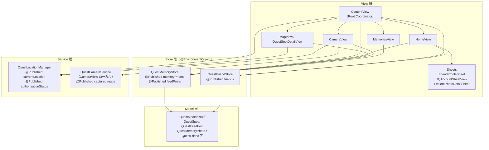

### 5-2. 状態の流れ

```
ContentView（@StateObject で生成）
  ↓ .environmentObject で配布
  ├── QuestMemoryStore  → HomeView / MapView / CameraView / MemoriesView が参照
  ├── QuestFriendStore  → HomeView / Account 系が参照
  └── QuestLocationManager → MapView / CameraView が参照

ContentView（@State で管理）
  ├── selectedTab: AppTab → JQFloatingTabBar と全タブに @Binding で渡す
  └── activeCameraSpotId: String → MapView と CameraView に @Binding で渡す
```

---

## 6. SwiftUI View 層の役割

| View ファイル | 役割 |
|-------------|-----|
| `ContentView.swift` | Root Coordinator。@StateObject 生成・配布・タブ切り替え制御 |
| `HomeView.swift` | フィード表示・いいね・コメント（@State ローカル）・Account シート |
| `MapView.swift` | MapKit 地図表示・スポットピン・QuestSpotDetailView（ボトムシート） |
| `CameraView.swift` | カメラプレビュー・撮影・保存フロー |
| `MemoriesView.swift` | Collect / Explore モード切替・県サマリー・写真詳細シート |
| `SharedComponents.swift` | AppBackground / JQUI / JQFloatingTabBar（共通 UI） |

**View 層の設計方針:**

- View はビジネスロジックを持たない。Store / Service に委譲する。
- 大きな View ファイルは型単位でセクション（`// MARK: -`）で分割する。
- サブコンポーネントは同一ファイル内に `private struct` として定義する。

---

## 7. Store / State 管理層の役割

### QuestMemoryStore

| 責任 | 詳細 |
|-----|-----|
| 撮影記録の保存・取得 | `memoryPhotos: [QuestMemoryPhoto]` を UserDefaults に永続化 |
| フィード投稿の保存・取得 | `feedPosts: [QuestFeedPost]` を UserDefaults に永続化 |
| 画像ファイルの書き込み・読み込み | Documents Dir への JPEG 書き込み・UIImage 読み込み |
| 7日フィルタ | `visibleFeedPosts()` で `expiresAt > now` をフィルタ |
| 進捗計算 | `completedCount(prefectureId:)` でコレクト進捗を集計 |
| 起動時パージ | `purgeExpiredFeedPosts()` で期限切れ投稿を削除 |

### QuestFriendStore

| 責任 | 詳細 |
|-----|-----|
| フレンド一覧管理 | `friends: [QuestFriend]` をインメモリで管理（開発MVP） |
| フレンド申請管理 | `incomingRequests: [QuestFriendRequest]` をインメモリで管理 |
| フレンド追加 | `addFriend(username:)` でリストに追加 |
| 申請承認・拒否 | `accept(_:)` / `decline(_:)` |

---

## 8. Service 層の役割

### QuestLocationManager

| 責任 | 詳細 |
|-----|-----|
| 位置情報取得 | `CLLocationManager` をラップ。`currentLocation: CLLocation?` を @Published で公開 |
| 権限管理 | `authorizationStatus: CLAuthorizationStatus` を @Published で公開 |
| 位置認証 | `isNear(_ spot: QuestSpot) -> Bool` でスポットの `unlockRadiusMeters` と比較 |
| 距離計算 | `distance(to spot:) -> CLLocationDistance?` |
| 使用頻度 | 撮影時のみ（常時追跡しない）。`requestWhenInUseAuthorization()` を使用 |

### QuestCameraService

| 責任 | 詳細 |
|-----|-----|
| カメラセッション管理 | `AVCaptureSession` を管理。バックグラウンドスレッドで実行 |
| 権限管理 | `permissionDenied: Bool` を @Published で公開 |
| 前後カメラ切り替え | `switchCamera(to position:)` |
| 撮影 | `capturePhoto(completion:)` → `UIImage?` をコールバックで返す |
| スコープ | `QuestCameraView` のみがローカル `@StateObject` として生成する |

---

## 9. Model 層の役割

```
QuestModels.swift に定義された型:

アクティブなモデル（現在使用中）:
  QuestUser         ユーザー情報
  QuestPrefecture   都道府県（スポット総数を持つ）
  QuestSpot         スポット（座標・認証半径・gridIndex）
  QuestFeedPost     Home フィード投稿（7日期限付き、Codable）
  QuestMemoryPhoto  Memories の撮影記録（永続、Codable）
  QuestFriend       フレンド関係
  QuestFriendRequest フレンド申請
  QuestVerificationStatus 位置認証ステータス（enum）

要精査のモデル（残存しているが参照不明）:
  RecentQuestPost   旧フィードモデル
  PrefectureMemory  旧 Memories モデル
  MemorySpot        旧スポットモデル
  MapDot / KanagawaDot 旧地図モデル
  QuestPost         旧投稿モデル（QuestFeedPost と別物）
```

**方針:** 要精査モデルは `grep -rn` で参照なしを確認後、Step 1-B-7 で削除する。

---

## 10. Local Storage 構成

### 10-1. 保存先の種別

| データ種別 | 保存先 | キー / パス |
|----------|-------|-----------|
| `[QuestMemoryPhoto]` メタデータ | UserDefaults | `"quest_memory_photos"` |
| `[QuestFeedPost]` メタデータ | UserDefaults | `"quest_feed_posts"` |
| 撮影画像ファイル | Documents Directory | `UUID().uuidString + ".jpg"` |

### 10-2. UserDefaults の読み書き

```
書き込み: JSONEncoder → Data → UserDefaults.standard.set(data, forKey:)
読み込み: UserDefaults.standard.data(forKey:) → JSONDecoder → 型へデコード
失敗時:  空配列を返し、モックデータにフォールバック
```

### 10-3. Documents Directory の読み書き

```
書き込み: UIImage → jpegData(compressionQuality: 0.88) → URL.write(data)
読み込み: UIImage(contentsOfFile: url.path)
ファイル名: UUID().uuidString + ".jpg"（保存時に生成）
```

### 10-4. ストレージ容量の注意事項

- 1枚あたり JPEG 圧縮率 0.88。目安として数百 KB〜1 MB 程度。
- 古い画像が Documents Dir に蓄積し続ける可能性がある（削除ポリシー未実装）。
- UserDefaults のサイズ上限（通常数 MB）を超えないよう注意が必要。

---

## 11. Mock Data 構成

`QuestSampleData.swift` に定義された定数:

| 定数名 | 型 | 役割 |
|-------|---|-----|
| `mockUsers` | `[QuestUser]` | 固定ユーザー3名（keita / haruka / sota） |
| `mockQuestPrefectures` | `[QuestPrefecture]` | 都道府県定義（神奈川・東京・京都・北海道） |
| `mockQuestSpots` | `[QuestSpot]` | スポット定義（全体。Map は神奈川のみフィルタ） |
| `mockQuestMemoryPhotos` | `[QuestMemoryPhoto]` | UserDefaults が空の場合の初期記録データ |
| `mockQuestFeedPosts` | `[QuestFeedPost]` | UserDefaults が空の場合の初期フィードデータ |
| `mockQuestFriends` | `[QuestFriend]` | QuestFriendStore の初期値 |
| `mockQuestFriendRequests` | `[QuestFriendRequest]` | 初期申請データ |

**モックデータの扱い方針:**

- `mockQuestSpots` と `mockQuestPrefectures` はバンドル内の静的定義として永続的に使用する。
- `mockQuestMemoryPhotos` / `mockQuestFeedPosts` は「UserDefaults が空のとき」のフォールバックである。ユーザーが1回でも撮影すると実データに切り替わる。
- 公開MVP でバックエンドを接続したら、フォールバックをモックデータから API レスポンスに置き換える。

---

## 12. MapKit / CoreLocation 構成

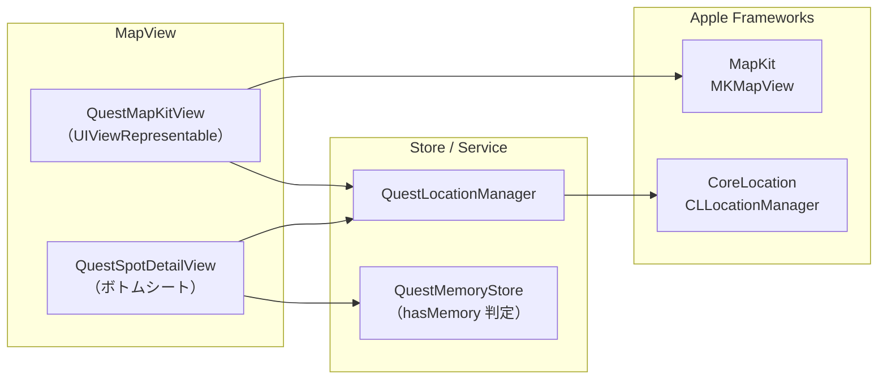

### 12-1. MapKit の使用方法

- `QuestMapKitView` が `UIViewRepresentable` として `MKMapView` をラップする。
- スポットピンは `MKAnnotation` として地図上に配置する。
- 神奈川スポットのみ表示（`mockQuestSpots.filter { $0.prefectureId == "kanagawa" }` 相当）。

### 12-2. CoreLocation の使用方法

- `CLLocationManager` を `QuestLocationManager` がラップする。
- `requestWhenInUseAuthorization()` で「使用中のみ許可」を要求する。
- Camera 画面でスポットとの距離を計算し、`unlockRadiusMeters` 以内なら撮影を許可する。
- 常時バックグラウンド追跡は行わない。

---

## 13. AVFoundation Camera 構成

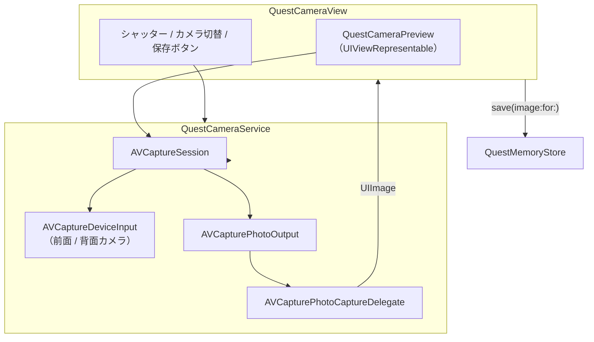

### 13-1. セッション管理

- セッションの設定・開始・停止はバックグラウンドキュー（`quest.camera.session.queue`）で実行する。
- メインスレッドへの影響を避けるため、UI の更新は `DispatchQueue.main.async` 経由で行う。

### 13-2. 撮影フロー

```
1. QuestCameraView.onAppear → cameraService.requestAndConfigure()
2. ユーザーがシャッターボタンをタップ → cameraService.capturePhoto()
3. AVCapturePhotoCaptureDelegate → UIImage に変換
4. CameraView の @State capturedImage に格納
5. ユーザーが「メモリーに保存」をタップ → memoryStore.save(image:for:...)
```

---

## 14. Photo 保存構成

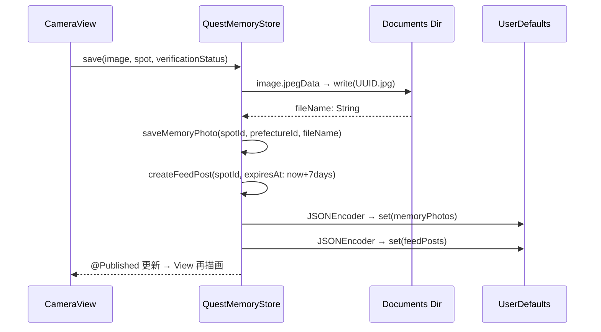

### 14-1. 保存時に記録するフィールド

| フィールド | 値 | 備考 |
|-----------|---|-----|
| `spotId` | Map から受け取った文字列 | 必須 |
| `prefectureId` | `spot.prefectureId` | 必須 |
| `imageName` | `UUID.jpg` | Documents Dir のファイル名 |
| `capturedAt` | `Date()` の文字列表現 | `"yyyy/MM/dd HH:mm"` |
| `verificationStatus` | `verified / developer / unverified` | 位置認証結果 |
| `expiresAt`（FeedPost のみ） | `now + 7日` | 7日フィルタに使用 |

---

## 15. Home Feed 構成

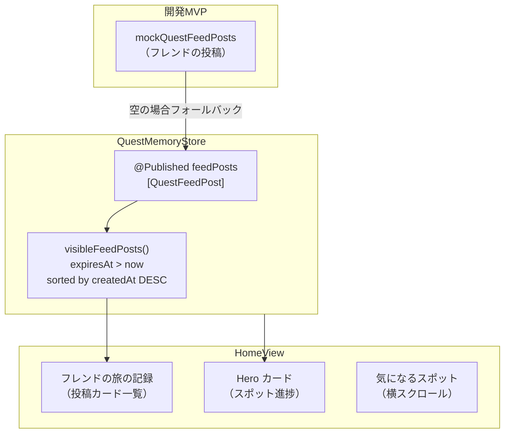

### 15-1. フィード表示ロジック

```
1. QuestMemoryStore.visibleFeedPosts() を呼ぶ
2. feedPosts から expiresAt > now のものだけ残す
3. createdAt の降順で並べ替える
4. HomeView が @EnvironmentObject 経由で結果を受け取り表示
```

### 15-2. いいね・コメントの管理（開発MVP）

```
HomeView の @State:
  likedPostIds: Set<String>       → いいね済み postId のセット
  commentsByPostId: [String: [String]]  → postId → コメント配列

計算:
  表示いいね数 = post.baseLikeCount + (likedPostIds.contains(post.id) ? 1 : 0)
```

---

## 16. Memories 構成

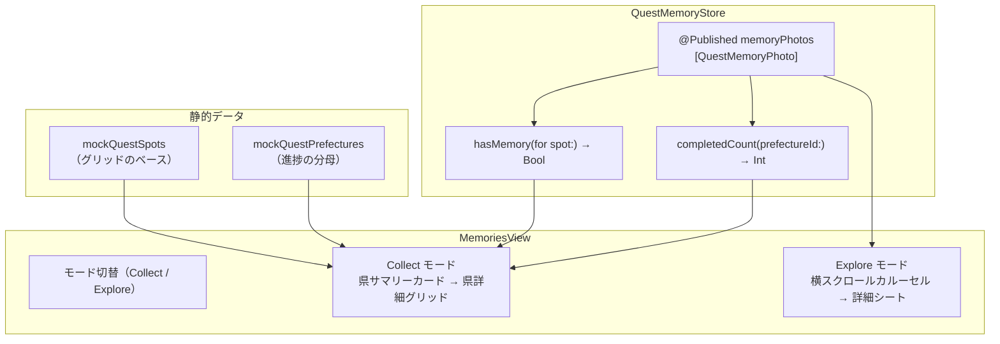

### 16-1. Collect モードの表示ロジック

```
県サマリー:
  completedCount(prefectureId:) / prefecture.totalSpotCount → 進捗

県詳細グリッド:
  mockQuestSpots（その県のスポット）を gridIndex 順に並べる
  spot ごとに hasMemory(for: spot) を判定
    → true  : 写真サムネイル（QuestMemoryPhoto.imageName から画像読み込み）
    → false : mappin アイコン（プレースホルダー）
```

### 16-2. Explore モードの表示ロジック

```
memoryPhotos を createdAtText 降順で表示
カードタップ → ExplorePhotoDetailSheet（全画面写真 + メタデータ）
```

---

## 17. 将来バックエンド構成

### 17-1. 候補

| 候補 | 特徴 | ピクトリへの適性 |
|-----|-----|--------------|
| **Firebase** | Google 製。Auth / Firestore / Storage / Cloud Functions がセット。iOS SDK が充実 | iOS アプリ向けに実績が多い。リアルタイム同期（Firestore）が投稿フィードに向く |
| **Supabase** | PostgreSQL ベース。Auth / DB / Storage / Edge Functions がセット。SQL で柔軟なクエリ | リレーショナルデータ構造（友達・投稿・いいね）に向く。オープンソース |

**方針:** 開発MVP 終了後に技術選定を行う。どちらを選んでも、Store 層の public インターフェースは変えず、内部実装のみを差し替える。

### 17-2. バックエンドが担当する処理

| 処理 | バックエンドの役割 |
|-----|----------------|
| ユーザー認証 | アカウント作成・サインイン・トークン発行 |
| フレンド管理 | フレンド申請・承認・一覧の DB 管理 |
| 投稿保存 | `QuestFeedPost` 相当のデータを DB に保存 |
| フレンドのフィード取得 | フレンドの投稿を API 経由で取得 |
| いいね・コメント | DB への書き込み・取得・リアルタイム同期 |
| 7日フィルタ | サーバーサイドでフィルタするか、クライアントでフィルタするか（設計時に決定） |

---

## 18. 認証構成

### 18-1. 開発MVP

```
認証なし。
固定ユーザー: userId = "user_keita"
QuestMemoryStore.createFeedPost() にハードコードされている。
```

### 18-2. 公開MVP

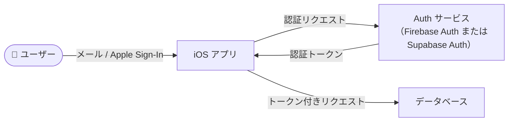

**公開MVP での認証方針:**

- サインイン方法: メールアドレス + パスワード、または Apple Sign-In（要検討）
- 認証トークンを全 API リクエストのヘッダーに付与する
- ユーザー ID はバックエンドが発行した UUID を使用する（`userId = "user_keita"` のハードコードを廃止）

---

## 19. 画像ストレージ構成

### 19-1. 開発MVP

```
撮影 → UIImage → JPEG 圧縮（0.88）→ Documents Dir / UUID.jpg
読み込み → UIImage(contentsOfFile: url.path)
共有 → なし（端末内のみ）
```

### 19-2. 公開MVP

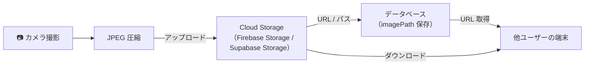

**移行時の設計方針:**

- 画像の保存・取得を `QuestMemoryStore` の内部に閉じ込める。View 層は `UIImage` を受け取るだけで、保存先（ローカル / クラウド）を意識しない設計を維持する。
- 既存のローカル画像ファイルは移行時に Cloud Storage へアップロードする手順を用意する（詳細は移行フェーズで設計）。

---

## 20. データ同期構成

### 20-1. 開発MVP

同期なし。すべてのデータは端末内で完結する。

### 20-2. 公開MVP での同期方針

| データ | 同期方法 | タイミング |
|-------|---------|---------|
| フレンドの投稿フィード | DB のリアルタイム購読 or 起動時 Pull | アプリ起動時・バックグラウンドから復帰時 |
| いいね数 | DB のリアルタイム購読 or 楽観的更新 | いいね操作時に即時反映、バックグラウンドで同期 |
| コメント | DB のリアルタイム購読 | コメント投稿時・フィード表示時 |
| 自分の投稿 | 保存時に DB へ書き込み | `save()` 呼び出し時 |
| Memories | 端末ローカルを正とし、クラウドにバックアップ | 保存時 or 定期同期 |
| フレンド一覧 | 起動時 Pull | アプリ起動時 |

**楽観的更新（Optimistic Update）の採用方針:**

いいね・コメントは UX を優先し、UI を即時更新してからバックグラウンドで DB に書き込む。書き込み失敗時はロールバックする。

---

## 21. セキュリティ・プライバシー観点

| 項目 | 開発MVP | 公開MVP |
|-----|--------|--------|
| 位置情報 | 撮影時のみ取得。端末外に送信しない | 同左。バックエンドへの送信は撮影記録の一部として行う |
| 写真データ | 端末内 Documents Dir のみ | Cloud Storage にアップロード（認証済みユーザーのみアクセス可） |
| ユーザー情報 | ハードコード。本物の個人情報なし | Auth によるセキュアな管理。パスワードはバックエンドが処理 |
| 通信 | なし | HTTPS 必須（Firebase / Supabase はデフォルトで HTTPS） |
| API キー | なし | `xcconfig` または環境変数で管理。コードにハードコードしない |
| フォトライブラリ | 使用しない（Documents Dir に直接保存） | 同左（または PHPhotoLibrary に追加する場合は権限を要求） |
| `developerUnlockMode` | `false`（`#if DEBUG` でのみ変更可） | `false`（固定）。App Store 提出前に必ず確認 |

---

## 22. 開発MVP から公開MVP への移行方針

### 22-1. 移行ステップ（想定）

```
Step 1: バックエンド技術選定（Firebase vs Supabase）
  → 要件・コスト・SDK の使いやすさを比較

Step 2: 認証機能の実装
  → Auth を導入し、固定ユーザー "user_keita" を廃止
  → QuestUser.id をバックエンドの UUID に置き換え

Step 3: 投稿・フィードのバックエンド化
  → QuestMemoryStore.save() の内部でバックエンドへも書き込む
  → visibleFeedPosts() をバックエンドからの取得に差し替え

Step 4: 画像ストレージの移行
  → Documents Dir への保存を Cloud Storage への保存に差し替え
  → 既存ローカル画像を Cloud Storage へ移行

Step 5: いいね・コメントのバックエンド化
  → HomeView の @State 管理を Store → バックエンドへ移行
  → Like / Comment モデルを新規定義・実装

Step 6: フレンド機能のバックエンド化
  → QuestFriendStore をバックエンド接続に更新
  → フレンド検索・申請・承認フローを実装

Step 7: データ同期の設定
  → リアルタイム購読 or 定期 Pull の方針に基づいて実装
```

### 22-2. 移行時に変わらない箇所

- `QuestLocationManager` の位置認証ロジック（`isNear(_:)`）
- `QuestCameraService` の AVFoundation 実装
- MapKit の地図表示ロジック
- Memories の Collect / Explore 表示ロジック（データソースの接続先のみ変わる）
- View 層の UI 実装（Store の public インターフェースが維持される限り変更不要）

---

## 23. システム構成上のリスク

| リスク | 影響度 | 対策 |
|-------|-------|-----|
| UserDefaults の容量上限 | 中（feedPosts が大量蓄積した場合） | `purgeExpiredFeedPosts()` による定期削除。上限サイズのモニタリング |
| Documents Dir の画像ファイル残存 | 低〜中（ストレージを圧迫する可能性） | Memory 上書き時の旧ファイル削除ロジックを実装する（現在未実装） |
| `activeCameraSpotId` のデフォルト値 | 低（初期値が "enoshima_coast" のため、直接タブ移動時に意図しないスポットになる） | nil 許容に変更し、spotId なしの Camera 起動時は Map 誘導を表示する |
| カメラ権限拒否のフォールバック未確認 | 高（App Store 審査基準に影響） | TestFlight 前に必ず実機確認する |
| バックエンド未選定 | 中（公開MVP の設計が確定しない） | TestFlight 外部テスト開始前に選定する |
| 旧モデルの残存（`QuestModels.swift`） | 低（動作に影響なし） | Step 1-B-7 でグレップ確認後に削除する |
| 認証なしの固定ユーザー | 高（公開MVP では必須） | 移行 Step 2 で対応。開発MVP 段階では UI 確認にのみ使用する |

---

## 24. 未決定事項

| 事項 | 現状 | 決定が必要なタイミング |
|-----|-----|------------------|
| バックエンド技術（Firebase vs Supabase） | 未決定。開発MVP はローカル完結 | TestFlight 外部テスト前 |
| 認証方式（メール / Apple Sign-In / 他） | 未決定 | バックエンド選定後 |
| 画像ストレージのアクセス制御 | 未決定（ユーザー本人のみ vs フレンド共有） | バックエンド設計時 |
| 7日ルールのサーバーサイド処理 | クライアントのみ vs サーバーサイドでもフィルタ | バックエンド設計時 |
| フィードの同期方式（リアルタイム vs Pull） | 未決定 | バックエンド設計時 |
| 既存ローカルデータの移行手順 | 未設計 | 公開MVP バックエンド接続時 |
| Documents Dir の画像削除ポリシー | 未実装（Memory 上書き時に旧ファイルが残る） | ストレージ管理設計時 |
| スポットデータのバックエンド管理 | 現在はバンドル内静的データ。将来 DB 管理に移行するかどうか未定 | 全国スポット対応フェーズ |
| Cloud Functions / Edge Functions の要否 | 未定。シンプルな CRUD なら不要かもしれない | バックエンド設計時 |
| 位置認証の許容半径（unlockRadiusMeters）の適切な値 | スポットごとに設定可能だが実地未検証 | 実機・現地テスト時 |
